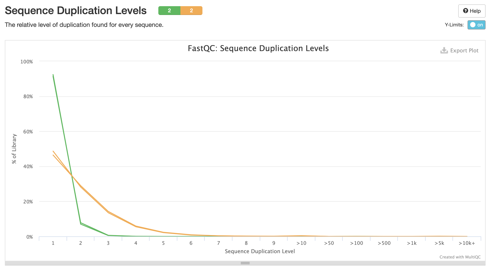
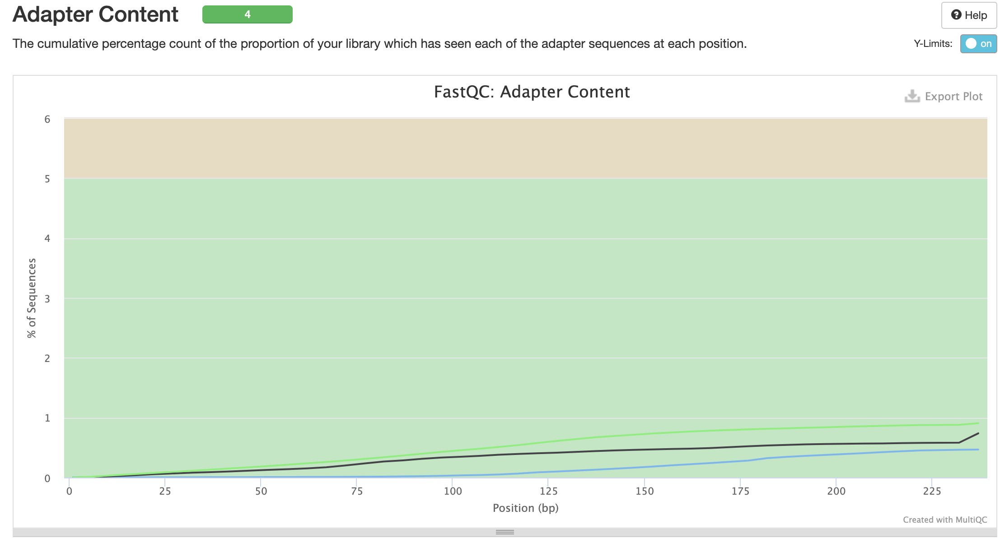

Команды выполненные на сервере:

```
ln -s /usr/share/data-minor-bioinf/assembly/oil_R1.fastq
ln -s /usr/share/data-minor-bioinf/assembly/oil_R2.fastq
ln -s /usr/share/data-minor-bioinf/assembly/oilMP_S4_L001_R1_001.fastq
ln -s /usr/share/data-minor-bioinf/assembly/oilMP_S4_L001_R2_001.fastq

seqtk sample -s102 oil_R1.fastq 5000000 > PE1.fq
seqtk sample -s102 oil_R2.fastq 5000000 > PE2.fq
seqtk sample -s102 oilMP_S4_L001_R1_001.fastq 1500000 > MP1.fq
seqtk sample -s102 oilMP_S4_L001_R2_001.fastq 1500000 > MP2.fq

mkdir fastqc
ls [MP,EP]* | xargs -t -I{} fastqc -o fastqc {}

mkdir multiqc
multiqc -o multiqc fastqc

platanus_trim PE1.fq PE2.fq
platanus_internal_trim MP1.fq MP2.fq

ls *.fq | xargs -t -I{} rm {}

mkdir fastqc_trimmed
ls [MP,EP]* | xargs -t -I{} fastqc -o fastqc_trimmed {}

mkdir multiqc_trimmed
multiqc -o multiqc_trimmed fastqc_trimmed

platanus assemble -f PE1.fq.trimmed PE2.fq.trimmed 2> assemble.log

platanus scaffold -c out_contig.fa -IP1 PE1.fq.trimmed PE2.fq.trimmed -OP2 MP1.fq.int_trimmed MP2.fq.int_trimmed 2> scaffold.log

platanus gap_close -c out_scaffold.fa -IP1 PE1.fq.trimmed PE2.fq.trimmed -OP2 MP1.fq.int_trimmed MP2.fq.int_trimmed 2> gap_close.log

ls [MP,EP]* | xargs -t -I{} rm {}
```

Jupyter ноутбук – в папке src.

Скриншоты из multiqc (до подрезания):





Скриншоты из multiqc (после подрезания):



